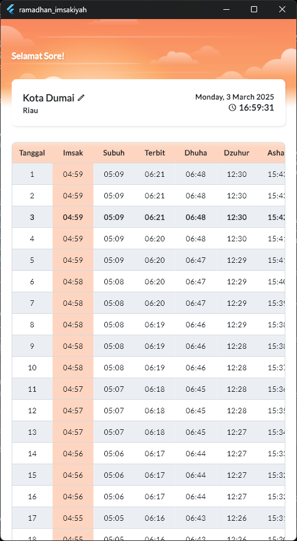
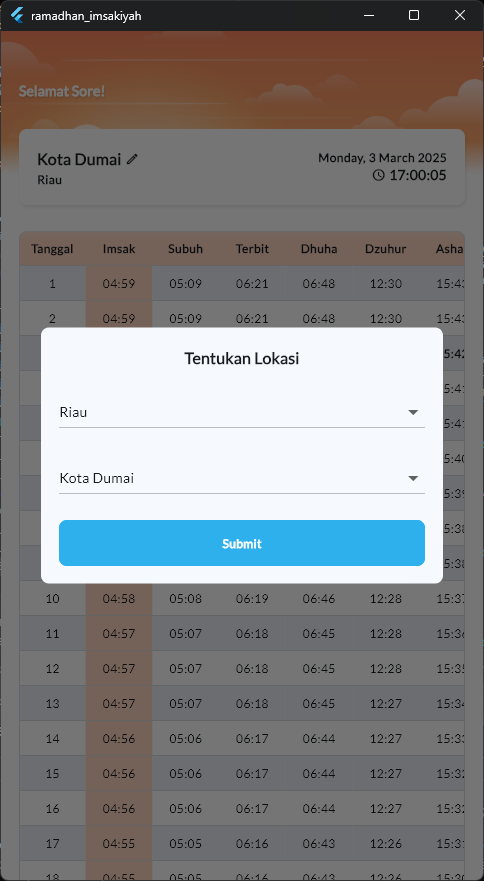

### This repository is my submission for the [IMPHEN Ramadhan Code Fest 2025](https://github.com/IMPHNEN/Ramadhan-Code-Fest-2025) event.
Literally, dikarenakan aku malas liatin tempelan brosur imsakiyah di dinding, jadi mending taruh di hp, bisa langsung liat kapan buka sambil scroll fesnuk 😅


# Ramadhan Imsakiyah App

A simple Ramadhan Imsakiyah app built using Flutter, leveraging the [Equran API](https://equran.id/apidev/v2) to provide prayer times and imsak schedules. This app follows the Clean Architecture pattern and uses Riverpod for state management.

<p align="left">
  
  
</p>

## Tech Stack

- **Flutter**: For building cross-platform UI.
- **Riverpod**: For state management.
- **Dio**: For handling HTTP requests.
- **GoRouter**: For declarative navigation.

## Installation

1. Clone this repository:
   ```sh
   git clone https://github.com/elrizwiraswara/ramadhan_imsakiyah.git
   ```

2. Navigate to the project folder:
   ```sh
   cd ramadhan-imsakiyah-app
   ```

3. Install dependencies:
   ```sh
   flutter pub get
   ```

4. Run the app:
   ```sh
   flutter run
   ```

## Contributing

Contributions are welcome! Please open an issue or submit a pull request for any bugs, feature requests, or improvements.

## License

This project is licensed under the MIT License - see the [LICENSE](LICENSE) file for details.

## Support

<a href="https://trakteer.id/elrizwiraswara/tip" target="_blank"></a>